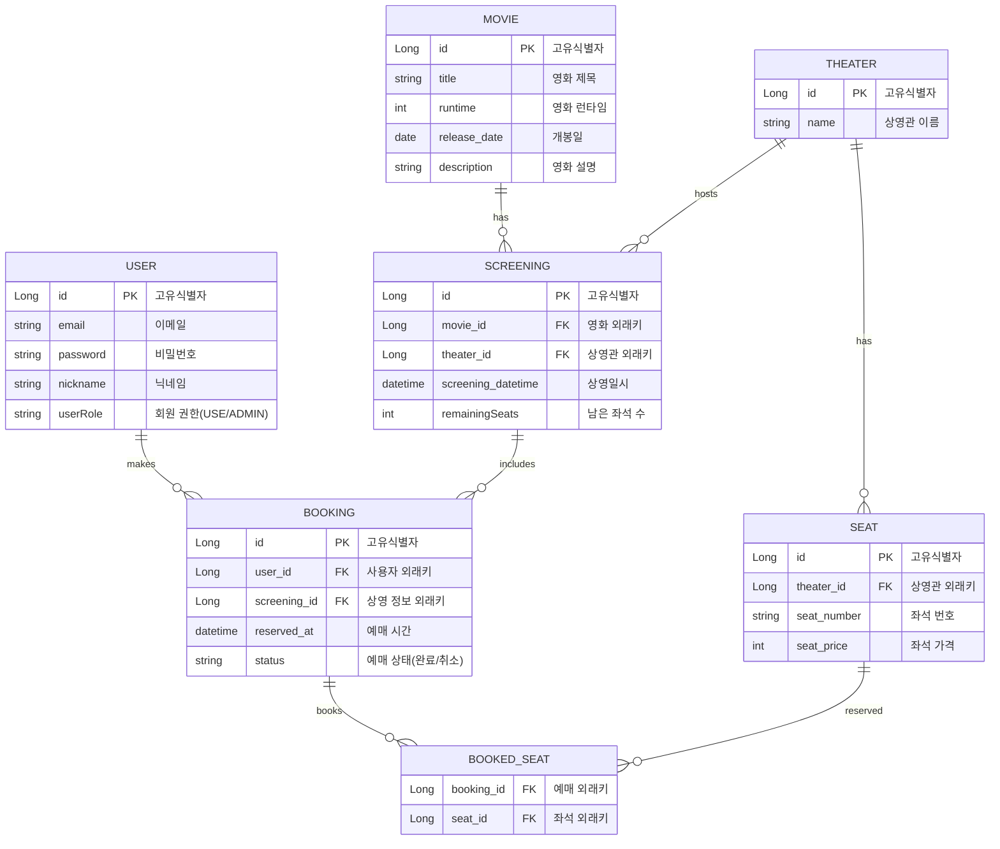

# CSV

13조 영화관 예매 프로젝트

## 프로젝트 목표

- Redis Lock을 이용한 동시성 이슈 제어
- Cache를 이용한 성능 개선

## 팀원 소개

|                   팀장                    |                팀원                 |                   팀원                   |                 팀원                  |
|:---------------------------------------:|:---------------------------------:|:--------------------------------------:|:-----------------------------------:|
| [홍승근](https://github.com/hongseungkeun) | [김호진](https://github.com/Hojin02) | [박재성](https://github.com/Lustella-123) | [임수민](https://github.com/sumin9926) | 

## 설계 및 문서

### 주요 기능

- 데이터 자동 삽입
- 예매 (동시성 제어)
    - 분산 락과 비관적 락을 활용한 예매 처리
- 검색 (Cache 사용)
    - 인기 검색어: RedisTemplate을 이용한 빠른 검색
    - 인기 영화 순위
        - v1: 데이터베이스 직접 조회
        - v2: RedisTemplate을 이용한 조회
        - v3: RedisTemplate과 @Cacheable을 이용한 캐싱 처리

### 와이어 프레임

- 

### API 명세서

- [노션](https://www.notion.so/teamsparta/ThirTeam-13-50005c7a1bed4a40b940e79c05861c38)

### ERD

